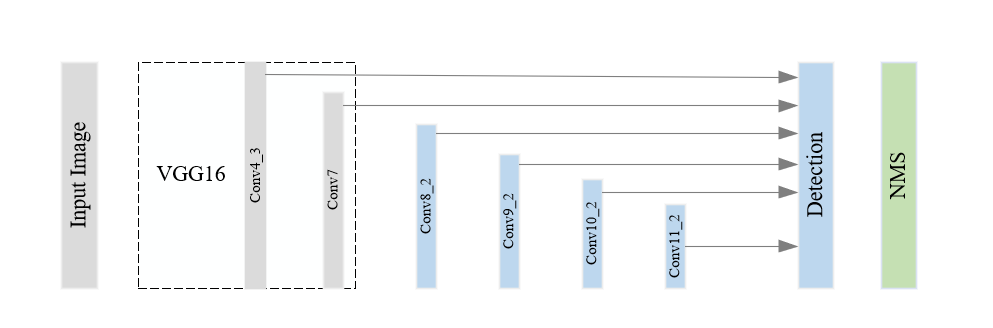
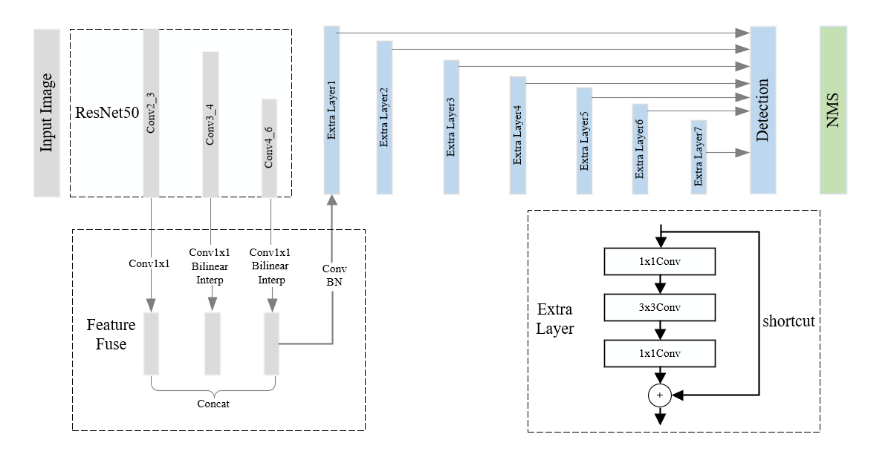
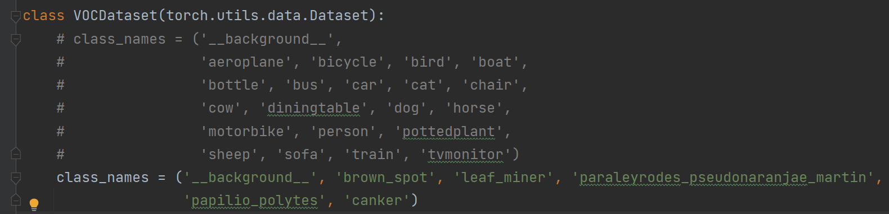

# 在病虫害（私人）数据集上进行SSD改进

代码是在这个仓库[SSD](https://github.com/lufficc/SSD). 基础上进行添加、修改的

在SSD基础上，主要改进点：
 1) 替换backbone为[Resnet/MobileNet](https://arxiv.org/abs/1512.03385)   

 2) 添加一种更加轻量高效的特征融合方式 [feature fusion module](https://arxiv.org/abs/1712.00960v1)   

 3) 添加注意力机制 ([Squeeze-and-Excitation Module](https://arxiv.org/abs/1709.01507) 和 [Convolutional Block Attention Module](https://arxiv.org/abs/1807.06521))      

 4) 添加一种解决正负样本不平衡的损失函数[Focal Loss](https://arxiv.org/abs/1708.02002)   


# 原始SSD网络结构和改进后的网络结构对比
原始ssd-vgg16网络结构图   
   
改进后的feature fusion + ssd + resnet50网络结构图



# CSDN源码关键部分讲解
[【项目一、xxx病虫害检测项目】1、SSD原理和源码分析](https://blog.csdn.net/qq_38253797/article/details/124209855)   
[【项目一、xxx病虫害检测项目】2、网络结构尝试改进：Resnet50、SE、CBAM、Feature Fusion](https://blog.csdn.net/qq_38253797/article/details/124267280)   
[【项目一、xxx病虫害检测项目】3、损失函数尝试：Focal loss](https://blog.csdn.net/qq_38253797/article/details/124295382)      


# 代码使用

### 配置环境
>pip install -r requirements.txt

### 使用自己的数据集
#### 数据集格式1、Pascal VOC

可以仿照VOC的数据格式：
```
datasets
|__ VOC2007
    |_ JPEGImages
    |_ Annotations
    |_ ImageSets
    |_ SegmentationClass
|__ VOC2012
    |_ JPEGImages
    |_ Annotations
    |_ ImageSets
    |_ SegmentationClass
|__ ...
```

#### 数据集格式2、COCO

也可以仿照COCO的数据格式：
```
datasets
|__ annotations
    |_ instances_valminusminival2014.json
    |_ instances_minival2014.json
    |_ instances_train2014.json
    |_ instances_val2014.json
    |_ ...
|__ train2014
    |_ <im-1-name>.jpg
    |_ ...
    |_ <im-N-name>.jpg
|__ val2014
    |_ <im-1-name>.jpg
    |_ ...
    |_ <im-N-name>.jpg
|__ ...
```
#### 修改对应的数据集文件
在ssd/data/datasets/voc.py或在ssd/data/datasets/coco.py中进行修改

修改示例（将class_names改为自己的数据集标签，注意0是背景）：


#### 修改配置文件
在configs/对应的配置文件中修改MODEL.NUM_CLASSES=classes+1


#### 开始训练 示例1
    Configs:
        Backbone: Resnet50
        Input size: 300
        SE: False
        CBAM: False
        FUSION: False
    Run:
        python train.py --config-file configs/resnet50_ssd300_voc0712.yaml
        
### 开始训练 示例2
    Configs:
        Backbone: Resnet50   
        Input size: 300
        SE: False      
        CBAM: False
        FUSION: True
    Run:
        python train.py --config-file configs/resnet50_ssd300_voc0712_feature_fusion.yaml

也可以自己修改/自定义config文件，进行训练

还可以按照DEVELOP_GUIDE.md的步骤自定义数据集，重写MyDataset函数进行训练

训练验证测试只需要修改train.py/test.py/demo.py中的配置文件地址和权重文件地址即可


# 训练效果（待更新）


# Reference
[lufficc/SSD](https://github.com/lufficc/SSD)
